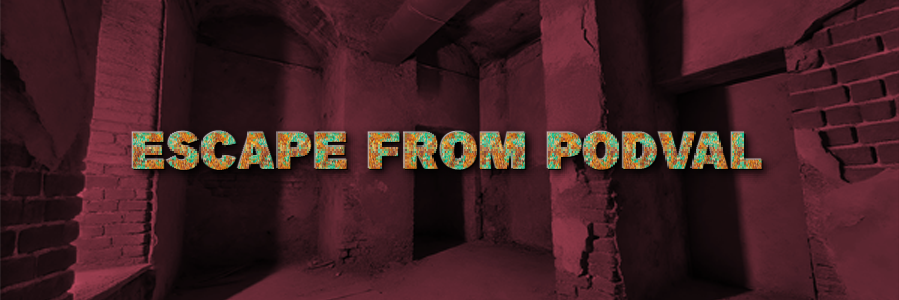
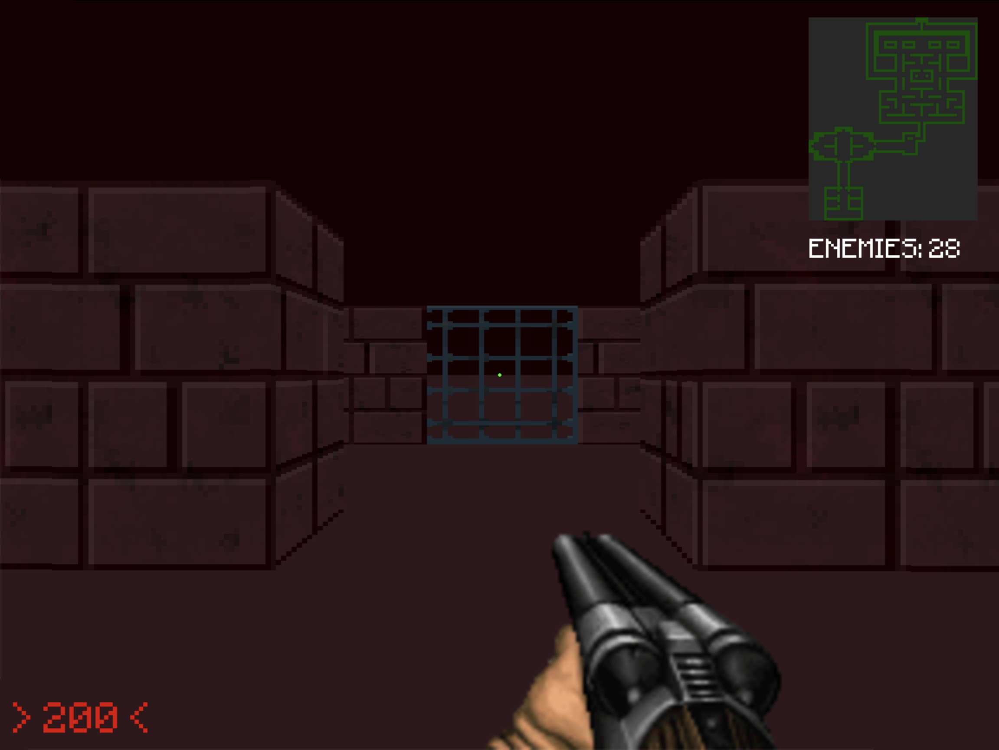
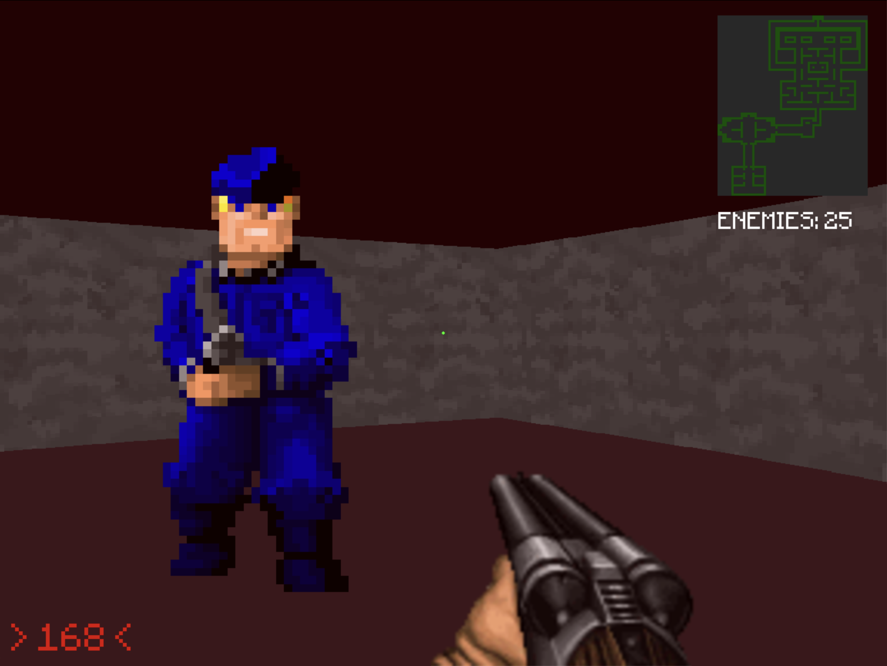

# **Escape From Podval: The Videogame**

**Разработчик:** Malakhov Alexey Vitalevich  
**Издатель:** Malakhov Alexey Vitalevich  
**Дата выхода:** 1 февраля 2022

---

## Описание

> "Escape From Podval" — это мрачный шутер от первого лица, который перенесет вас в тесные и темные лабиринты заброшенного подземелья. Здесь нет солнечного света, но есть эхо шагов, скрежет металла и пугающий шепот, раздающийся из глубины.

Исследуйте обширные локации, сражайтесь с опасными врагами и раскрывайте тайны древних цивилизаций. Вас ждет более **5 минут** игрового процесса, захватывающий геймплей и уникальная система динамичных сражений.

---

## Особенности игры

- 🔦 **Тесные коридоры подвал** а — исследуйте запутанные коридоры и скрытые комнаты, каждый шаг может стать последним.
- 💥 **Брутальные перестрелки** — почувствуйте отдачу оружия и ощутите адреналин, когда каждый патрон на счету.
- 🎶 **Оригинальный саундтрек** — музыка от известного композитора enggineer_sound.

---

## Требования системы

### Минимальные:
- **ОС:** Windows 10 (64-bit)
- **Процессор:** Intel Core i5-6400 / AMD Ryzen 3 1200
- **Оперативная память:** 8 GB RAM
- **Видеокарта:** NVIDIA GeForce GTX 970 / AMD Radeon RX 570
- **Python:** Version 3.9
- **Место на диске:** 80 MB

### Рекомендуемые:
- **ОС:** Windows 11 (64-bit)
- **Процессор:** Intel Core i7-9700 / AMD Ryzen 5 3600
- **Оперативная память:** 16 GB RAM
- **Видеокарта:** NVIDIA GeForce RTX 2070 / AMD Radeon RX 6700 XT
- **Python:** Version 3.12
- **Место на диске:** 80 MB

---

## Скриншоты

---

## Отзывы игроков

> **"Игра потрясающая! Великолепная графика и увлекательный геймплей!"**  
> — _СашаТрубачев2005_

> **"Динамика боя просто шикарная, а атмосфера подвала захватывает с первых минут."**  
> — _PlayGeim_

---
## Купить игру

- **Цена:** 0 ₽
- **Купить сейчас:** `git clone https://github.com/Alex00999/ESCAPE-FROM-PODVAL.git`

---
Запуск игры осуществляется через `main.py`. Модуль `pygame` не поставляется в комплекте.

